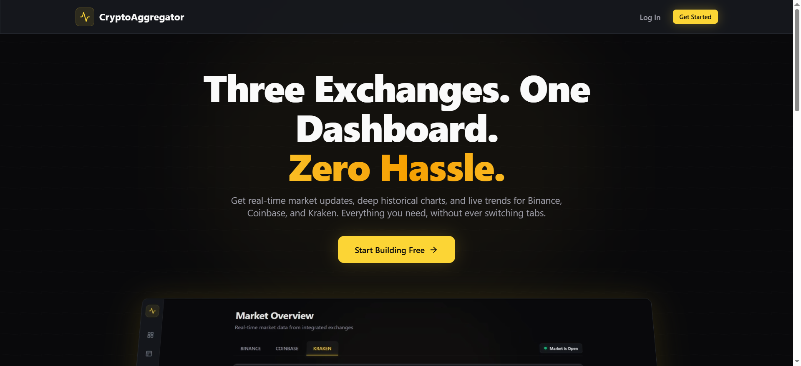
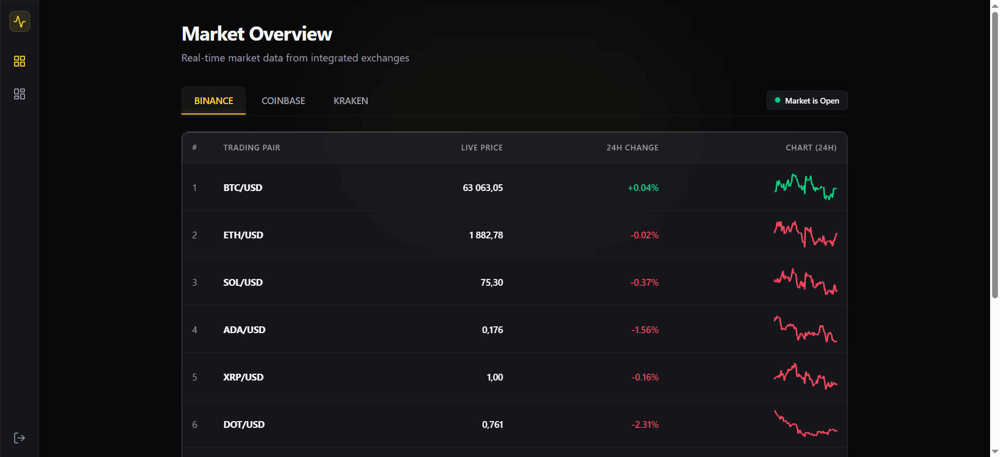
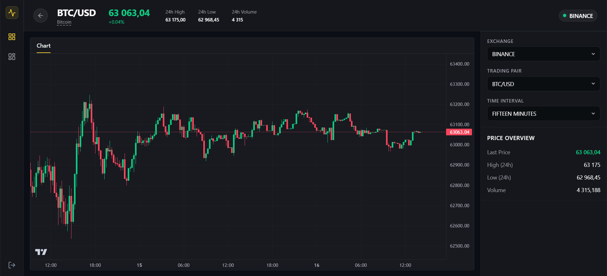
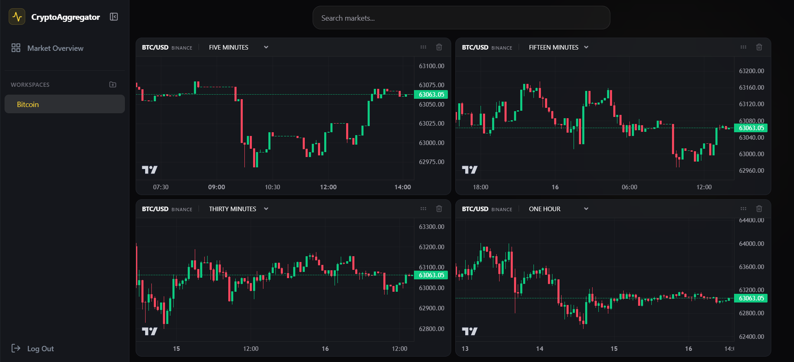

# CryptoAggregator


## 🚀 Overview

**CryptoAggregator** is a unified real-time cryptocurrency market dashboard that aggregates live pricing data from the three largest exchanges — **Binance**, **Coinbase**, and **Kraken** — into a single, seamless interface.

The application eliminates the need for traders to switch between multiple exchange tabs by providing:

- A consolidated **Market Overview** with live prices, 24h changes, and sparklines.
- **Interactive candlestick charts** with selectable trading pairs, exchanges, and timeframes.
- **Custom multi-chart workspaces** for multi-timeframe analysis (e.g., a "Bitcoin" workspace with 4+ charts side-by-side).

---

## ✨ Key Features

### 🏠 Landing Page
A clean entry point with a clear value proposition: **Three Exchanges. One Dashboard. Zero Hassle.** The landing page introduces the platform and guides users into the main application.

### 📊 Market Overview
A real-time aggregated table displaying:
- Current prices across Binance, Coinbase, and Kraken.
- 24-hour price change percentages.
- Mini sparkline charts per exchange for quick trend visualization.

### 📈 Detailed Charting
Interactive TradingView-style candlestick charts powered by `lightweight-charts`, supporting:
- Any supported trading pair.
- Exchange selection (Binance / Coinbase / Kraken).
- Multiple timeframes (e.g., 15m, 1h, 4h, 1d).

### 🗂 Custom Workspaces (Multi-Chart)
Users can create named workspaces (e.g., "Bitcoin", "Ethereum") and arrange **4 or more charts** in a grid layout. Each widget in the workspace can be independently configured with its own pair, exchange, and timeframe — enabling powerful multi-timeframe analysis in one view.

---

## 📸 Gallery

### Landing Page


### Market Overview Dashboard


### Detailed Pair Chart


### Multi-Chart Workspace


---

## 🏛 Architecture & Design Principles

The backend is built around a **modular, exchange-agnostic architecture** designed for scalability, testability, and clean separation of concerns.

### 🔌 Strategy Pattern for Exchange Integration
Each exchange (Binance, Coinbase, Kraken) is implemented as a **strategy** behind a common interface. This allows the application to normalize heterogeneous external APIs into a unified internal model.

- **Historical Data:** `AbstractHistoricalExchangeStrategy` defines the contract; concrete implementations (`BinanceHistoricalExchangeStrategy`, `CoinbaseHistoricalExchangeStrategy`, `KrakenHistoricalExchangeStrategy`) handle exchange-specific REST endpoints, parameter formats, and response mapping.
- **Live Data:** WebSocket strategies subscribe to exchange-specific streams and map incoming ticker events into a common domain event.

### 🔄 Reactive Streaming for Live Tickers
The backend uses **Spring WebFlux / WebClient** to maintain persistent WebSocket connections to all three exchanges simultaneously. Live price updates are streamed reactively, ensuring low-latency delivery to the frontend without blocking threads.

### 🧩 Layered Architecture with DDD Influence
The codebase follows a strict layered structure:

```
controller → service → repository → database
```

DTOs are used for API contracts, while domain models represent internal business logic. **MapStruct** handles efficient, compile-safe mapping between layers.

### 🔐 Security & Authentication
- **JWT-based authentication** with access and refresh tokens.
- **Token blacklisting** via Redis for secure logout.
- **Spring Security** protects API endpoints with stateless session management.

### 🗄 Persistence & Caching
- **PostgreSQL** stores user accounts, custom workspaces, and chart widget configurations.
- **Redis** serves dual purposes: JWT token blacklist and application-level caching for frequently accessed market data.
- **Flyway** manages versioned database migrations.

### 🧪 Testing Strategy
- **Unit tests** with JUnit 5 and Mockito.
- **Integration tests** using **Testcontainers** (PostgreSQL) and **Database Rider** for dataset-driven testing.
- **REST Assured** for API contract verification.
- **JaCoCo** for code coverage reporting.

### 📄 API-First Design
The backend exposes a **OpenAPI 3.0** specification. Client DTOs and interfaces are auto-generated using **OpenAPI Generator**, ensuring type-safe contracts between frontend and backend.

---

## 🛠 Tech Stack

### Backend
| Technology | Purpose |
| :--- | :--- |
| **Java 21** | Runtime language |
| **Spring Boot 4.0.6** | Application framework |
| **Spring WebFlux / WebClient** | Reactive HTTP client & WebSocket streaming |
| **Spring Security + JWT (JJWT)** | Authentication & authorization |
| **Spring Data JPA + Hibernate** | ORM & database access |
| **Spring Data Redis** | Caching & token blacklist |
| **PostgreSQL 16** | Primary relational database |
| **Flyway** | Database migration versioning |
| **MapStruct** | DTO ↔ Entity mapping |
| **OpenAPI Generator** | API contract code generation |
| **Lombok** | Boilerplate reduction |
| **Gradle** | Build automation |
| **Testcontainers / JUnit 5 / REST Assured** | Testing stack |

### Frontend
| Technology | Purpose |
| :--- | :--- |
| **React 18** | UI library |
| **TypeScript 5.6** | Type safety |
| **Vite** | Build tool & dev server |
| **Tailwind CSS 4** | Utility-first styling |
| **lightweight-charts** | Financial candlestick charting |
| **react-router-dom** | Client-side routing |
| **@dnd-kit** | Drag-and-drop for workspace layout |
| **lucide-react** | Icon library |
| **Nginx** | Production static file serving |

---

## 🐳 Getting Started

The fastest way to run the entire stack is using **Docker Compose** from the project root.

### Prerequisites
- Docker & Docker Compose
- (Optional) Node.js 20+ for local frontend development
- (Optional) JDK 21 + Gradle for local backend development

### One-Command Startup

```bash
docker compose up --build
```

This will start the full stack:

| Service | Port | Description |
| :--- | :--- | :--- |
| **Frontend** | `http://localhost` | React SPA served via Nginx |
| **Backend API** | `http://localhost:8080` | Spring Boot REST & WebSocket API |
| **PostgreSQL** | `localhost:5432` | Database (user: `postgres`, pass: `postgres`) |
| **Redis** | `localhost:6379` | Cache & session store |

> **Note:** The backend depends on PostgreSQL and Redis health checks. Containers will start in the correct order automatically.

---

## 💻 Local Development

### Backend

```bash
cd crypto-aggregator-be

# Ensure PostgreSQL and Redis are running locally or via Docker
# Then start the Spring Boot application
./gradlew bootRun
```

The backend will be available at `http://localhost:8080`.

### Frontend

```bash
cd crypto-aggregator-fe

# Install dependencies
npm install

# Start dev server with HMR
npm run dev
```

The frontend will be available at `http://localhost:5173` (or the port shown in the terminal).

---

## ⚙️ Environment Variables

### Backend (`crypto-aggregator-be/.env`)

| Variable | Default | Description |
| :--- | :--- | :--- |
| `POSTGRES_HOST` | `postgres` | PostgreSQL host |
| `POSTGRES_PORT` | `5432` | PostgreSQL port |
| `POSTGRES_USER` | `postgres` | Database username |
| `POSTGRES_PASSWORD` | `postgres` | Database password |
| `REDIS_HOST` | `redis` | Redis host |
| `REDIS_PORT` | `6379` | Redis port |
| `SECRET_TOKEN` | *(required)* | JWT signing secret |
| `ACCESS_TOKEN` | `3600000` | Access token expiration (ms) |
| `REFRESH_TOKEN` | `604800000` | Refresh token expiration (ms) |

### Frontend

| Variable | Default | Description |
| :--- | :--- | :--- |
| `VITE_API_URL` | *(empty)* | Backend API base URL (e.g., `http://localhost:8080`) |

---

## 📂 Project Structure

```
crypto-aggregator/
├── docker-compose.yaml          # Full stack orchestration
├── assets/
│   └── images/                  # Screenshots for README
├── crypto-aggregator-be/        # Spring Boot backend
│   ├── src/main/java/...
│   ├── docs/                    # Exchange API integration specs
│   ├── build.gradle
│   └── Dockerfile
└── crypto-aggregator-fe/        # React frontend
    ├── src/
    ├── package.json
    └── Dockerfile
```

---

## 📄 License

This project is licensed under the MIT License.
